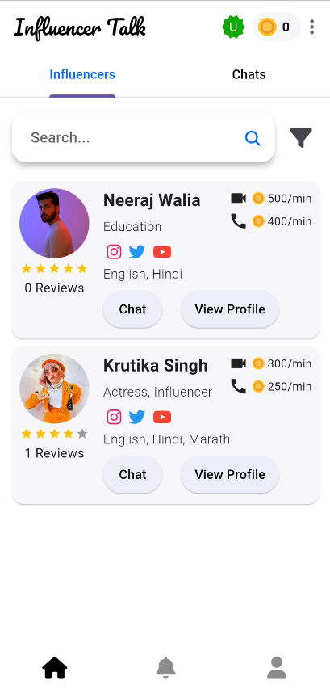
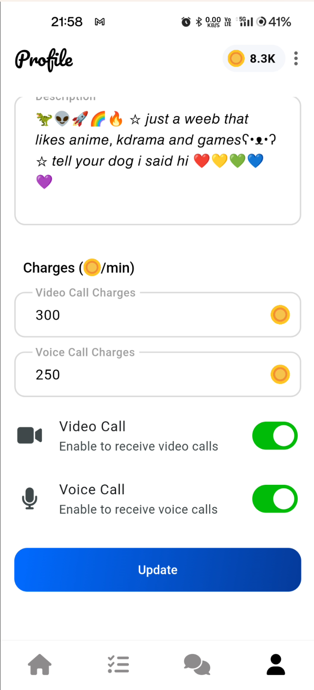

# Getting started

## User Onboarding

* Sign up using email, phone number and full name.
* Users can also choose to use their google account to sign in.

## Home Page

* Users can navigate to chat with influencers, profile page or view their chat history.

## Profile details page

* Here users can choose to edit their profile details.

