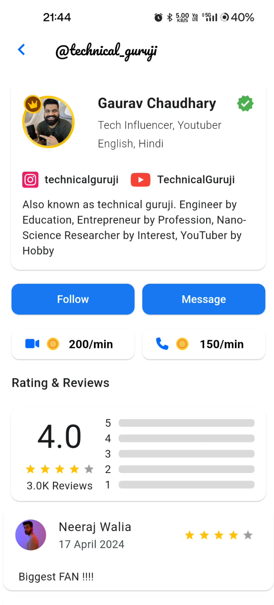

# Getting started

## User Onboarding

* Users can sign up using their phone number/E-mail ID or they can authenticate using their Google Account

* They can also Login into their account using their Phone Number/E-mail ID or Google Account

## Home Page

* Home page consists of a list of available influencers
* Chat Button and View profile buttons are used to chat with the influencer and view their profile respectively

## Chats Page

* The chats contains the conversations of the user with the influencers

## Profile Details Page

* The profile page contains user information that can be edited by the user

